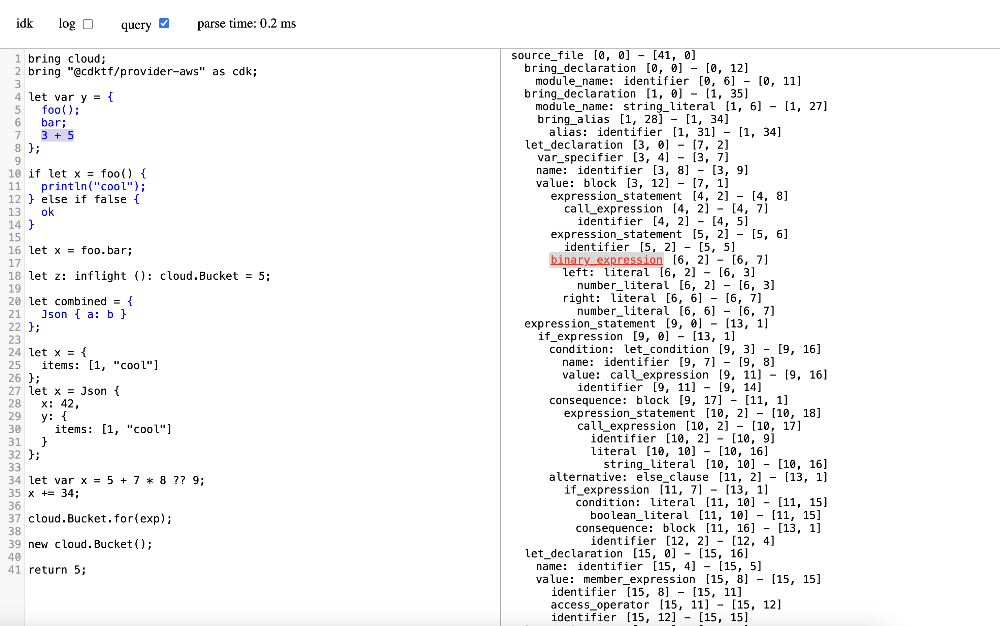

Hacking on grammars that support block-style expressions like Rust.

Code example

<code>
bring cloud;
bring "@cdktf/provider-aws" as cdk;

let var y = {
  foo();
  bar;
  3 + 5
};

if let x = foo() {
  println("cool");
} else if false {
  ok
}

let x = foo.bar;

let z: inflight (): cloud.Bucket = 5;

let combined = {
  Json { a: b }
};

let x = {
  items: [1, "cool"]
};
let x = Json {
  x: 42,
  y: {
    items: [1, "cool"]
  }
};

let var x = 5 + 7 * 8 ?? 9;
x += 34;

cloud.Bucket.for(exp);

new cloud.Bucket();

return 5;
</code>

https://github.com/rust-lang/wg-grammar/tree/7a1bd645fd50d8783da7e2010da8bcc226d656ea/grammar

## Development

* `npm install`
* `npm run tree-sitter build-wasm`
* `npm run tree-sitter playground`
* `npm run watch`
